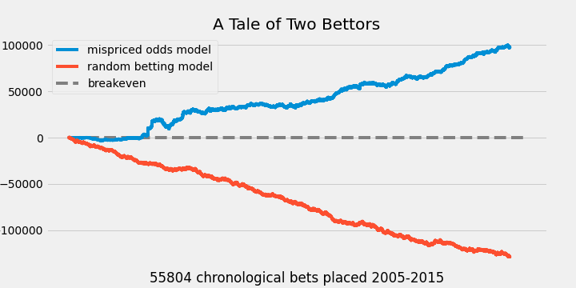
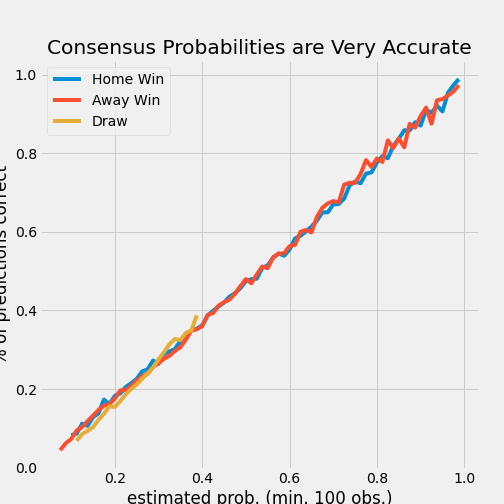
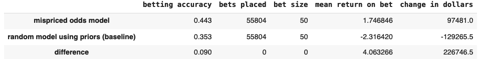

# Online Sports Betting: Beating the Bookie

## INTRODUCTION

I made my first bet in high school. I was sure the New York Yankees would beat the Arizona Diamondbacks in the World Series but I lost five dollars. Even so, getting even odds was a good bet. No betting exchange would have given me those odds on the heavily favored Yankees. The fact is, every solvent betting exchange offers odds at fair value, minus a commission. The bet functions like betting black on an American roulette wheel: the probability of black is not 18/36 but 18/38 because the house claims 0 and 00 for itself. Bookmakers pay data scientists very well to make sure the exchange's odds are accurately estimating the probability of various sporting event outcomes. For this reason, most value betting strategies are long-term losers.

Betting algorithms are programs designed to identify profitable betting opportunities by analyzing large amounts of data. Most fall into one of two categories: **value** bets or **arbitrage** bets.

* **Value betting algorithms** are the commonest type of betting algorithm. These algorithms collect data from thousands of past sporting matches, estimate the probability of bettable outcomes, and identify bookmakers offering odds on those outcomes that are below **expected value**.

* **Arbitrage betting algorithms** take advantage of patterns in odds. The opportunity occurs when a better can guarantee a small profit by taking both sides of a bet. These algorithms do not try to predict the occurence of sporting outcomes but instead, the odds themselves.

Once the bet is chosen, the algorithm may also choose an appropriate bet size, also called **bankroll management**.

Thanks to Lisandro Kaunitz, Shenjun Zhong & Javier Kreiner, there is a third approach. In **Beating the bookies with their own numbers - and how the online sports betting market is rigged (2017)**, the authors introduced me to a novel and brilliant approach to sports betting. Rather than compete with the bookmakers predictions, they show how to beat the bookmakers by using their predictions against them. They demonstrate how to take advantage of mispriced odds using the implicit information in bookmakers' aggregate odds. It turns out that sometimes bookmakers intentionally offer discounted odds to balance their books or make special offers. Bookmakers countered the authors success by limiting the size and type of bets they were allowed to place, leading to the second conclusion of the paper: any bettor who finds a consistently profitable strategy will encounteer discriminatory practices at the hands of betting exchanges. 

Lisandro Kaunitz details his team's real-world results on his personal blog. Five months of ten-hour days monitoring a server and hastily placing the recommended bets turned $4,000 into $5,000. After server fees, this worked out to having a job that pays $2/hour. Nevetheless, th team was having a blast and would have continued the experiment if not for the fact that bookmakers began limiting the size and type of bets they were allowed to place. Bookies are under no obligation to continue taking bets if they don't believe it's in there best interest and Kaunitz was barred from most bookmakers' platforms.

Link to paper: https://www.researchgate.net/publication/320296375_Beating_the_bookies_with_their_own_numbers_-_and_how_the_online_sports_betting_market_is_rigged

Kaunitz's Blog: https://www.lisandrokaunitz.com/index.php/en/category/beatthebookies-en/

---

## SUMMARY 

I set out to create a value betting algorithm for this project but the paper linked to above convinced me it would be a lesson in futility. I believe strategies based on team and player attributes are very unlikely to compete successfully with the models bookmakers' use to set odds. Aggregating many bookmakers' odds, however, can tell a bettor when an individual bookmaker is offering mispriced odds. Furthermore, a strategy that exploits these opportunities repeatedly can significantly outperform random betting in the long-term. In this repo, I create such a model using soccer match data while following Kaunitz's method closely.

*Figure 1*.  A bettor making $50 bets using the recommended strategy would have made $97 thousand between 2005 and 2015. The random better (using prior probabilities of soccer match outcomes and placing an equal number bets) loses $129 thousand over the same period. (y-axis in US dollars, x-axis represents a ten year span of time)

## DATA

Kaunitz, et al. collected historical closing odds (i.e. odds provided at game-time) for 479,440 soccer matches between 2005 and 2015 from 32 online bookmakers. The hard part of scraping the data off bookies' websites and cleaning it has been done for me.

| Feature       | Description    |
|---------------|----------------|
| 'league'      |  pro soccer league |
| 'match_date'  |  match date        |
| 'home_team'   |  home team         |
| 'home_score'  |  home team goals scored    |
| 'away_team'   |  away team                 |
| 'away_score'  |  away team goals scored    |
| 'avg_odds_home_win'   |  average odds for bet on home team win at game start|
| 'max_odds_home_win'   |  best odds for bet on home team win at game start   |
| 'top_bookie_home_win' | bookmaker offering max odds                 |
| 'n_odds_home_win'     | number of bookmakers providing odds for bet |

**Home win** data repeats for **away win** and **draw** (not shown), the other two possible outcomes of a soccer match.

A full list of the bookmakers:
---
Interwetten https://www.interwetten.com/en/sportsbook, bwin https://sports.bwin.com/en/sports, bet-at-home https://www.bet-at-home.com/en/sport, Unibet https://www.bet-at-home.com/en/sport, Stan James http://stanjames-betting.com/, Expekt https://www.expekt.com/en-fi, 10Bet https://www.10bet.com/sports/, William Hill https://www.williamhill.com/, bet365 https://www.nj.bet365.com/#/HO/, Pinnacle Sports https://www.pinnacle.com/en/, DOXXbet https://m.doxxbet.com.lr/ui/#/, Betsafe https://www.betsafe.com/en, Betway https://betway.com/en/sports, 888sport https://www.888sport.com, Ladbrokes https://sports.ladbrokes.com/, Betclic https://www.betclic.com/en/sports-betting/, Sportingbet https://sports.sportingbet.com/en/sports, myBet , Betsson, 188BET, Jetbull, Paddy Power, Tipico, Coral, SBOBET, BetVictor, 12BET, Titanbet, Youwin, ComeOn, Betadonis, Betfair

## REPRODUCE IT

1. Acquire the prepared data

The prepared dataset in the form of csv files is available for download at https://www.kaggle.com/austro/beat-the-bookie-worldwide-football-dataset. The notebook included in this repository uses only the file "closing_odds.csv". The csv file is a matrix of soccer games (rows) x features (teams, scores, league, etc).

2. Exploration of odds data.

Code or visualizing the odds is contained in the notebook. I used a linear regression (OLS) model and Pearson correlation to evaluate the consensus probabilities of bookmakers. I confirmed the hypothesis that aggregate odds are a strong predictor of the underlying probabilty of sporting event outcomes.

*Figure 2*.  The key point underlying the strategy. Bookie's provide odds of a soccer team winning, losing, or drawing the match at game time. The average of these adds is almost exactly the true, underlying probability of the event. Any bookie offering odds implicitly above this underlying probability, after accounting for a commission, is likely undervaluing their odds. (cutoff text of y-axis is the actual percentage of correct predictions at the given estimated probability)

3. Build a model to identify mispriced odds.

The author's built the original model in MATLAB while my notebook is in Python. I encourage the interested reader to follow along with the paper mentioned in this readme's introduction. There you will find full mathematical explanations of the betting strategy. 

## RESULTS

The mispriced odds identification model *significantly outperforms* a random betting strategy using the prior probabilities of game outcomes, as confirmed in the notebook using a Welch's t-test comparing bet results.

The next step is to create a model capable of evaluating bookmakers' continuous odds in order to make predictions in real-time.

